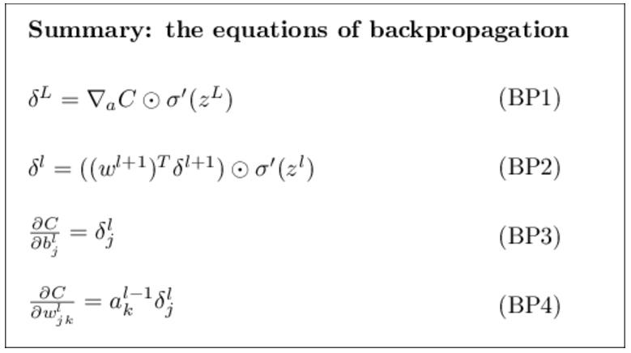

# back prop

Hadamard product(按位相乘)

$$ (s\odot t)_{j}=s_{j}t_{j} $$

前向传播

$$C=\frac{1}{2}||y-a^{L}||^{2}= \frac{1}{2}\sum_{j}(y_{j}-a_{j}^{L})^{2}$$
$$ a^{l}=\sigma(z^{l}) $$
$$z^{l}=w^{l}a^{l-1}+b^{l}$$

后向传播

$$\delta^{l}=\frac{\partial C}{\partial z^{l}}$$

# mlp

1. 前馈神经网络（包括全连接层、卷积层等）可以表示为 

$$F = f_{3} (f_{2} (f_{1} (xW_{1})W_{2})W_{3})$$

网络输出对$W_{1}$求偏导

$$ \frac{\partial F}{\partial W_{1}}= x*f'_{1}*W_{2}*f'_{2}*W_{3}*f'_{3} $$

这里$W_{1}W_{2}W_{3}$ 是相互独立的，一般不会有数值问题；主要问题在于激活函数的导数$f'$在饱和区接近于零，导致梯度消失。

# cnn

