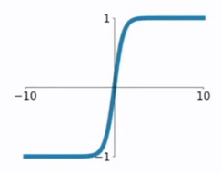
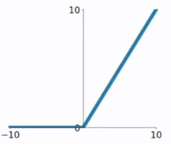
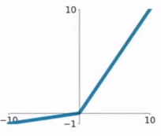

# 激活函数

sigmoid, tanh, ReLU, ELU, PReLU, 

## sigmoid

$$ \sigma(x)=\frac{1}{1+e^{-x}}$$

1. 当输入稍微远离了坐标原点，函数的梯度就变得很小了，几乎为零。
2. 函数输出不是以0为中心的，这样会使权重更新效率降低。因为这会导致后层的神经元的输入是非0均值的信号，这会对梯度产生影响：假设后层神经元的输入都为正,那么对w求局部梯度则都为正，这样在反向传播的过程中w要么都往正方向更新，要么都往负方向更新，导致有一种捆绑的效果，使得收敛缓慢
3. sigmoid函数要进行指数运算，这个对于计算机来说是比较慢的
4. sigmoid导数最大为1/4，$|w_{j}\sigma'(z_{j})|>1$，即$|w_{j}|$>4才会出现梯度爆炸，这种情况不经常出现；最普遍的是梯度消失问题

## tanh

$$tanh=\frac{sinh(x)}{cosh(x)}=\frac{e^{x}-e^{-x}}{e^{x}+e^{-x}} $$

1. tanh是双曲正切函数，和sigmoid函数的曲线是比较相近的；
2. 不同的是输出区间，tanh的输出区间是在(-1,1)之间，而且整个函数是以0为中心的

## relu

$$f(x)=max(0, x) $$

1. 在输入为正数的时候，不存在梯度消失问题；输入负数，梯度就会完全到0
2. 计算速度要快很多
4. 不以0为中心

## PＲeLU

$$f(x)=max(ax, x) $$

当α=0.01时，我们叫PReLU为Leaky ReLU